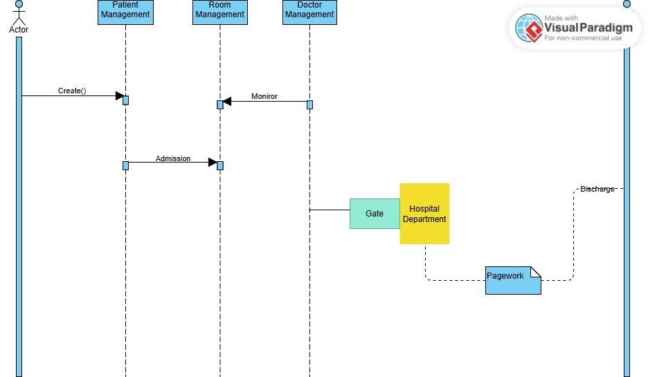

# HỆ THỐNG QUẢN LÝ BỆNH VIỆN

## GIỚI THIỆU DỰ ÁN
Đây là dự án quản lý Bệnh viện
## Các thành viên trong nhóm
- **Nguyễn Văn Thành-23010191**:Phát triển phần mềm
- **Nguyễn Mạnh Quyền-23010198**:Phát triển phần mềm

## Project : HospitalManagement
Yêu cầu chính:
- Giao diện <b>Java Spring Boot</b>.
-Quản lý bệnh nhân
+ Thêm, sửa, xóa bệnh nhân.
+ Liệt kê thông tin về bệnh nhân, có thể lọc ra các bệnh nhân theo độ tuổi.
- Có chức năng quản lý phòng điều trị.
+ Thêm, sửa, xóa bệnh án.
- Có chức năng gán bệnh nhân cho phòng điều trị.

## Các chức năng
### Addition(Thêm vào)
public ArrayList<Patient> addPatient(Patient patient) {
        patients.add(patient);
        return patients;
    }
### Inds(Cập nhật)
### Edit(Chỉnh sửa)
public ArrayList<Patient> editPatient(String fullname, int patientID) {
        for (int i = 0; i < patients.size(); i++) {
            if (patients.get(i).patientId == patientID) {
                System.out.print("true");
                patients.get(i).fullname = fullname;
            }
        }
        return patients;
    }
### Remove(Xóa)
public ArrayList<Patient> deletePatient(int patientID) {
        for (int i = 0; i < patients.size(); i++) {
            if (patients.get(i).patientId == patientID) {
                patients.remove(i);
                break; // Dừng sau khi xoá để tránh lỗi ConcurrentModificationException
            }
        }
        return patients;
    }
## Sơ đồ khối
### 1.UML Class Diagram

### 2.UML Sequence Diagram

