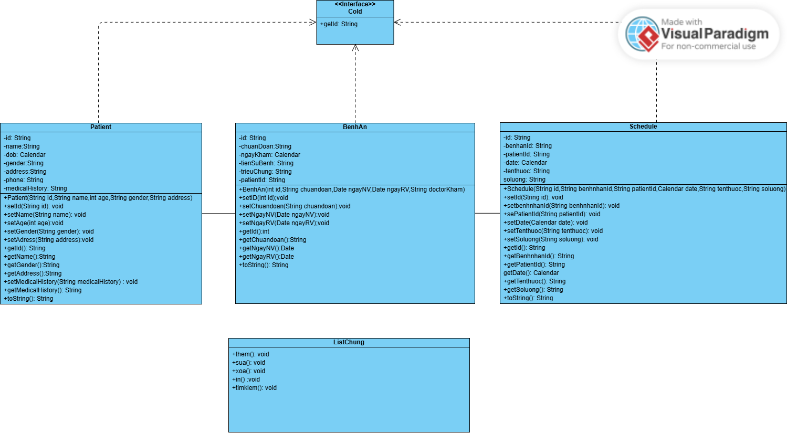
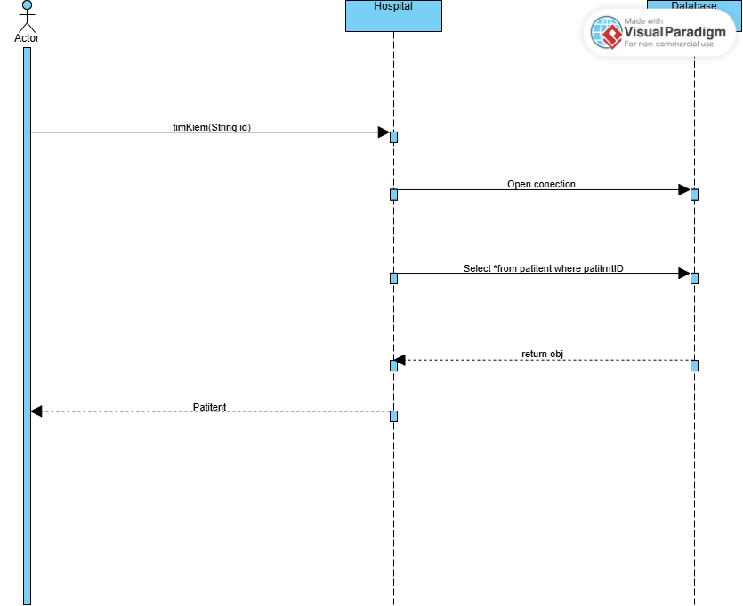
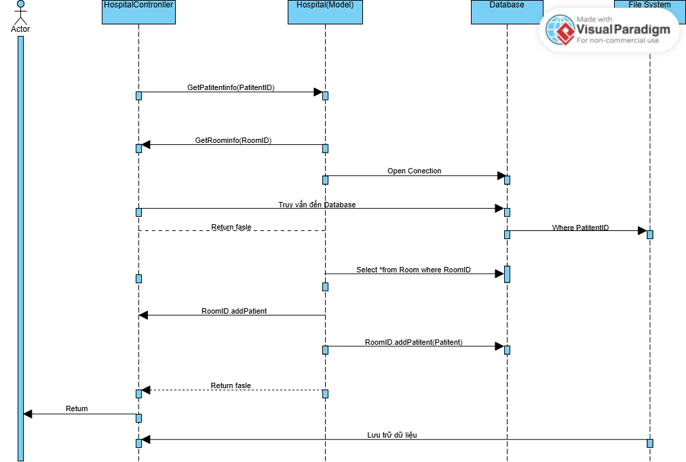

# HỆ THỐNG QUẢN LÝ KHÁM CHỮA BỆNH

## GIỚI THIỆU DỰ ÁN
Đây là dự án quản lý khám chữa bệnh
## Các thành viên trong nhóm
- **Nguyễn Văn Thành-23010191**:Phát triển phần mềm
- **Nguyễn Mạnh Quyền-23010198**:Phát triển phần mềm

## Project : HospitalManagement
Yêu cầu chính:
- Giao diện <b>Java Spring Boot</b>.
-Chức năng thông tin bệnh nhân
+ Thêm, sửa, xóa bệnh nhân, tìm kiếm thông tin bệnh nhân bất kì.
+ Liệt kê thông tin về bệnh nhân.
- Có quản lý bệnh án.
+ Thêm, sửa, xóa,tìm kiếm bệnh án, thông tim phòng khác và bác sĩ khám cho bệnh nhân trong hồ sơ.
- Có quản lý lịch cấp thuốc cho bệnh nhân
+ Thêm,sửa,xóa,tìm kiếm ngày cấp thuôc của bệnh nhân.

## Sơ đồ khối
### 1.UML Class Diagram

### 2.UML Sequence Diagram

#### 1.Findpatitent

#### 2.FindBenhan

#### 3.Schedule

#### 4.Room

